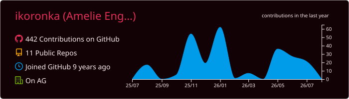
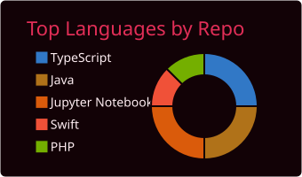
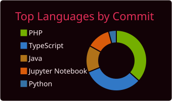
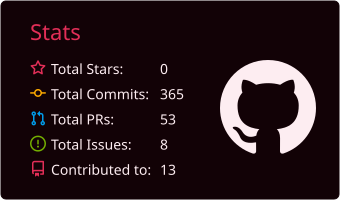
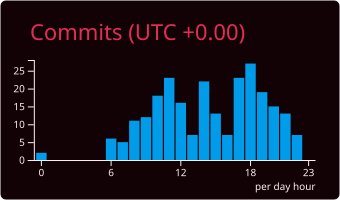

<h1 align="center">
  
</h1>
<h3 align="center">
  A creative developer based in Zurich 🇨🇭
</h3>

Currently interning as a SWE at [On](https://www.on.com/en-ch/)
 
Feel free to reach out if you have any qs!

  

  
  

  
  

